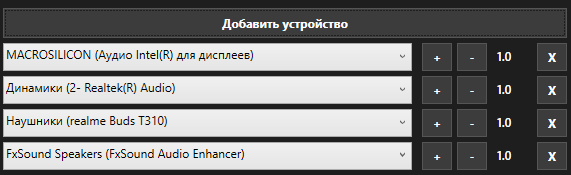
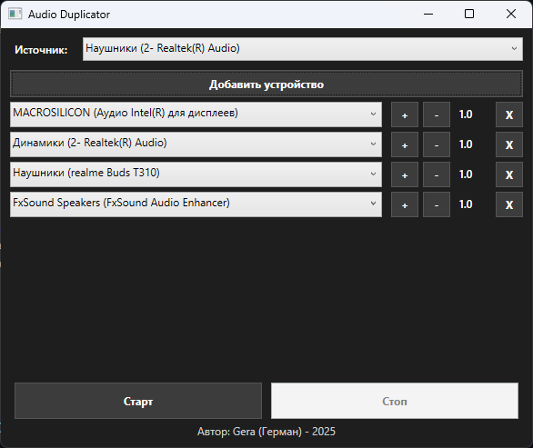

# Audio Duplicator

Программа для дублирования звука с одного устройства воспроизведения на несколько других устройств на Windows.  
Использует библиотеку [NAudio](https://github.com/naudio/NAudio) для работы с аудио.

---

## Основные возможности

- Выбор источника звука (любое активное аудиоустройство воспроизведения)  
  
- Дублирование звука на несколько устройств (до 5)  
  
- Регулировка громкости для каждого устройства отдельно  
  
- Поддержка удержания кнопок для плавного изменения громкости
- Автоматическая обработка исключений при отсутствии доступных устройств

---

## Требования

- Windows 10/11
- .NET 6 или выше
- Visual Studio 2022 и новее
- NAudio (через NuGet)

---

## Установка и запуск программы

1. Скачайте последний релиз программы в zip архиве.
2. Распакуйте архив.
3. Запустите Audio_Duplicator.exe

## Запуск программы из исходного кода

1. Склонируйте репозиторий:

```bash
git clone https://github.com/GInerus/Audio-Duplicator.git
````

2. Откройте проект в Visual Studio 2022
3. Установите через NuGet пакет **NAudio**
4. Соберите проект и запустите

---

## Использование

1. Выберите источник звука в верхнем выпадающем списке.
2. Добавьте устройства-приёмники через кнопку "Добавить устройство".
3. Регулируйте громкость каждого устройства с помощью кнопок `+` и `-`.
   Можно удерживать кнопки для плавного изменения.
4. Нажмите **Старт** для начала дублирования.
5. Нажмите **Стоп** для остановки дублирования.

---

## Пример работы



---

## Лицензия

Этот проект лицензирован под MIT License.
Автор: Gera (Герман) - 2025
